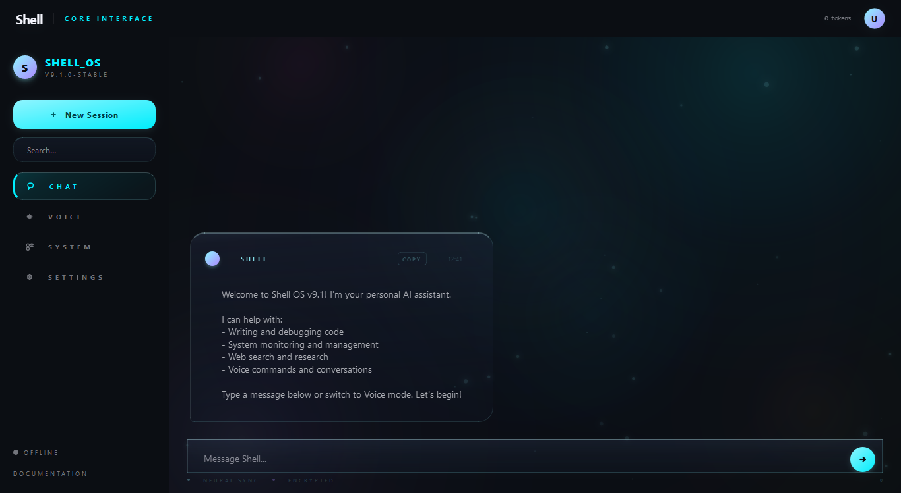
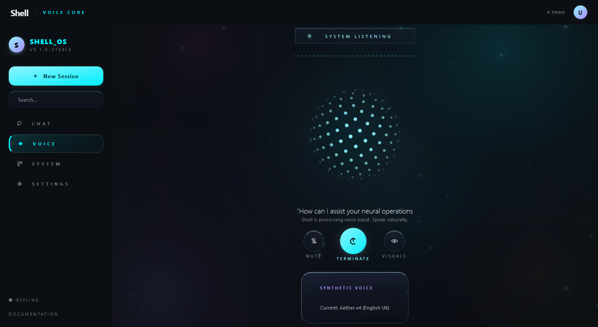
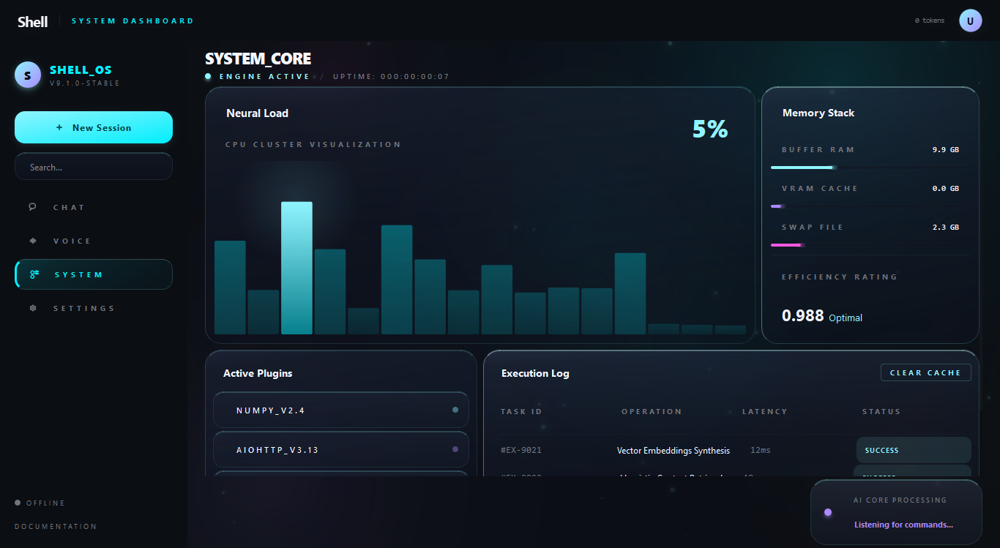
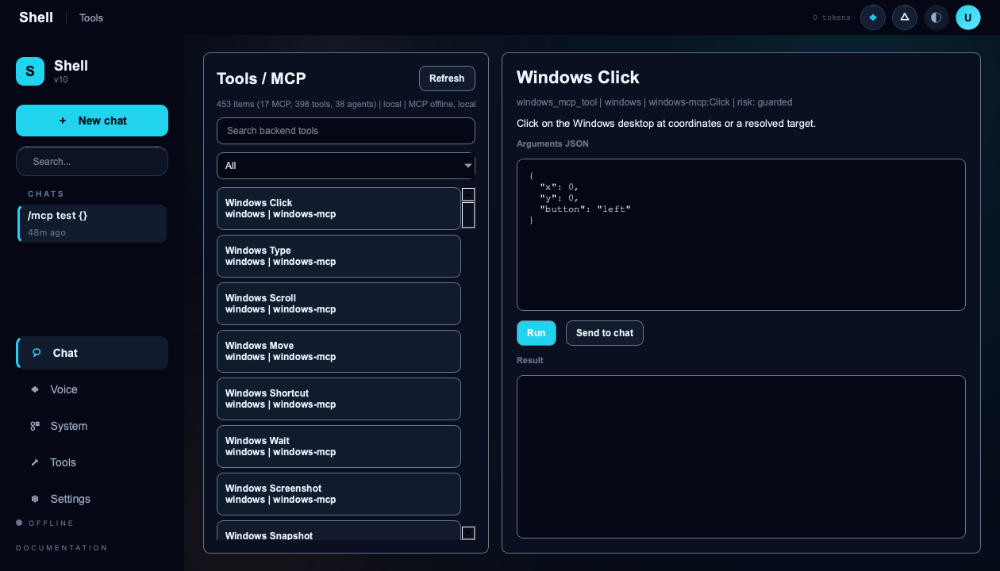
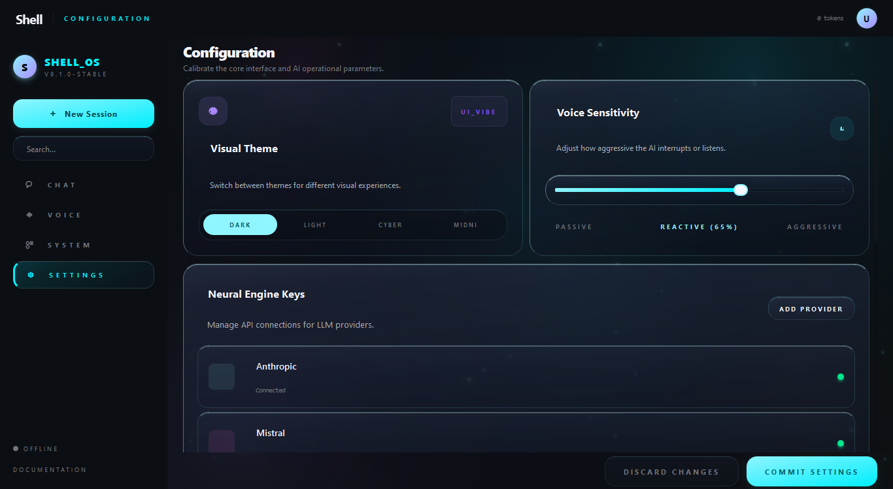
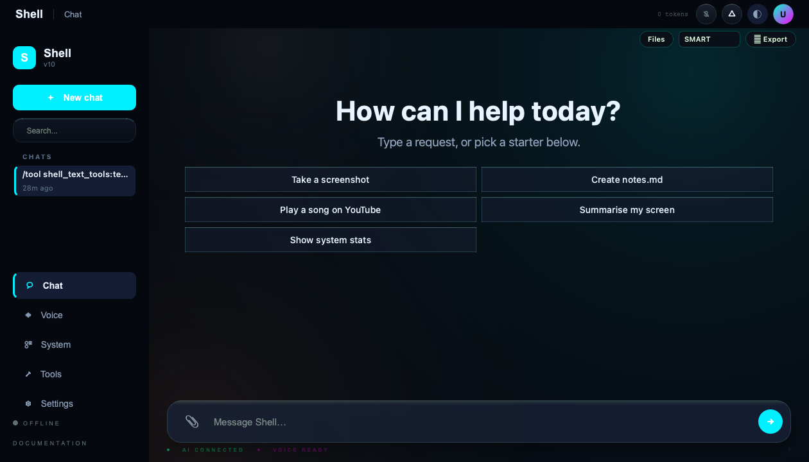
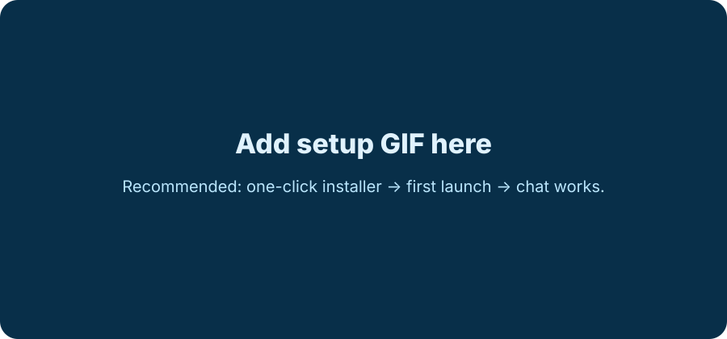

<!-- SPDX-License-Identifier: Apache-2.0 -->

<p align="center">
  
</p>

<p align="center">
  
</p>

<h1 align="center">Shell AI OS Controller</h1>

<p align="center">
  A local-first AI desktop control layer for chat, voice, tools, automation, and runtime diagnostics.
</p>

<p align="center">
  <a href="LICENSE"></a>
  
  
  
  
</p>

<p align="center">
  <strong>Version:</strong> 1.0.0 ·
  <strong>Creator:</strong> mdshoebking ·
  <strong>License:</strong> Apache-2.0 ·
  <strong>Primary OS:</strong> Windows 10/11
</p>

---

## What Shell Is

Shell AI OS Controller is a Python desktop assistant and automation platform
that connects a modern PyQt UI with AI providers, voice, local tools, desktop
automation, Telegram, email, browser control, and structured runtime
diagnostics.

It is not an operating system replacement, not a custom AGI model, and not a
self-aware system. It is a practical AI-native desktop control layer designed
to make local workflows easier to run, observe, and improve.

## Product Positioning

Shell is positioned as an **AI-native desktop control layer**: part AI
assistant, part automation platform, part local workflow console.

It is built for users who want an AI workspace that can explain readiness,
route tools safely, recover from missing dependencies, and keep the human user
in control.

## Why It Exists

Most AI assistants stop at chat. Shell is built around the idea that an
assistant should also understand tools, runtime state, settings, voice,
desktop actions, and recovery paths.

The goal is simple:

- Fast conversation.
- Real tool execution.
- Clear errors.
- Safe automation.
- Beginner-friendly install.
- Open-source growth.

## Product Experience

Shell is designed around visible confidence:

- A first-launch welcome tour explains chat, voice, tools, and help.
- Health checks show what is ready, missing, or Windows-only.
- Text chat stays text-first unless the user explicitly asks to hear audio.
- Risky automation remains gated by safety settings.
- Release packages exclude secrets, venvs, logs, generated builds, and cloned
  third-party repos.

## Feature Highlights

| Area | What Shell Provides |
| --- | --- |
| Chat | Text chat with streaming-style UI, tool routing, and grounded responses |
| Voice | Gemini voice path plus local TTS fallback and low-latency voice UI |
| Tools | 300+ Python tools behind a guarded execution gateway |
| Desktop | App/window control, screenshots, clipboard, keyboard/mouse automation |
| Browser | Browser automation wrappers with safety gates and dry-run support |
| Telegram | Remote-control bot with explicit token setup and permission controls |
| Email | SMTP sending with clear Gmail app-password diagnostics |
| Media | Image generation, QR tools, PDF tools, YouTube summaries, OCR hooks |
| Runtime | Health checks, readiness states, logs, production release gates |
| Installer | One-click Windows bootstrap plus macOS/Linux launch helpers |

## Screenshots

Real public showcase screenshots are stored in `screenshots/showcase/`.

| Chat | Voice |
| --- | --- |
|  |  |

| Runtime | Tools |
| --- | --- |
|  |  |

| Settings | Windows Acceptance |
| --- | --- |
|  |  |

## Demo Media

| Media | Placeholder |
| --- | --- |
| Setup GIF |  |
| Voice Demo |  |

Recommended launch media:

- 60-second install GIF.
- 90-second voice demo video.
- 2-minute "chat opens apps and runs tools" demo.
- 5-minute technical architecture walkthrough.

Storyboards:

- [GIF demo storyboards](gifs/storyboards/README.md)
- [Launch video storyboards](videos/storyboards/README.md)

## Architecture

<p align="center">
  
</p>

High-level flow:

```text
User
  -> PyQt UI / Voice / Telegram
  -> Shell Hub + Runtime State
  -> Agent + Planner + Tool Gateway
  -> Local Tools / APIs / Desktop Automation / Browser Automation
  -> Structured Result + Logs + UI Update
```

## Folder Structure

```text
.
├── agent.py                         # Main AI agent runtime
├── shell_ui/                        # PyQt desktop interface
├── shell_tool_gateway.py            # Tool execution gateway
├── shell_telegram.py                # Telegram bot integration
├── shell_windows_mcp.py             # CursorTouch Windows-MCP bridge
├── core/                            # Modular runtime, health, memory, orchestration
├── installer/                       # Bootstrap, health, and repair logic
├── tools/                           # Release, probes, diagnostics, packaging
├── docs/                            # Architecture and rollout documents
├── assets/brand/                    # Official Shell logo and brand rules
├── screenshots/                     # Public screenshots and showcase captures
├── gifs/                            # GIF placeholders and storyboards
├── videos/                          # Video placeholders and storyboards
├── banners/                         # Public banner and social assets
├── .github/                         # Issue and pull request templates
├── LICENSE                          # Apache-2.0 license
├── NOTICE                           # Attribution notice
├── LEGAL.md                         # Beginner-friendly legal report
├── SECURITY.md                      # Security policy
└── THIRD_PARTY_NOTICES.md           # Dependency/license audit notes
```

## Beginner Install

### Windows

For normal users:

```text
1. Download the release zip.
2. Extract it.
3. Double-click ONE_CLICK_INSTALL.bat.
4. Double-click Start_ShellAI.bat.
```

What the installer does:

- Detects Python.
- Creates a virtual environment.
- Installs Python dependencies.
- Runs health checks.
- Prepares runtime folders.
- Starts Shell through the production launcher.

If something breaks:

```text
Double-click Repair_ShellAI.bat
```

### macOS

```bash
chmod +x ONE_CLICK_INSTALL.command start_shellai.command repair_shellai.command
./ONE_CLICK_INSTALL.command
./start_shellai.command
```

### Linux

```bash
chmod +x start_shellai.sh repair_shellai.sh
./start_shellai.sh
```

For a detailed beginner guide, see [docs/INSTALL_BEGINNER.md](docs/INSTALL_BEGINNER.md).

## Documentation

- [Documentation index](docs/README.md)
- [Product experience](docs/PRODUCT_EXPERIENCE.md)
- [Design system](DESIGN.md)
- [Phase 6 UI/UX audit](docs/UI_UX_PHASE6_REPORT.md)
- [Product experience design](docs/PRODUCT_EXPERIENCE_DESIGN.md)
- [Screenshot and demo strategy](docs/SCREENSHOT_DEMO_STRATEGY.md)
- [Trust and credibility](docs/TRUST_AND_CREDIBILITY.md)
- [Beginner install guide](docs/INSTALL_BEGINNER.md)
- [Developer guide](docs/DEVELOPER_GUIDE.md)
- [Architecture guide](docs/ARCHITECTURE_GUIDE.md)
- [API and tool guide](docs/API_GUIDE.md)
- [Troubleshooting](docs/TROUBLESHOOTING.md)
- [FAQ](docs/FAQ.md)
- [Advanced usage](docs/ADVANCED_USAGE.md)
- [Roadmap](docs/ROADMAP.md)
- [AI ecosystem roadmap](docs/ECOSYSTEM_ROADMAP.md)
- [Website plan](docs/WEBSITE_PLAN.md)
- [Public launch plan](docs/PUBLIC_LAUNCH_PLAN.md)
- [Community guide](docs/COMMUNITY.md)
- [Release process](docs/RELEASE_PROCESS.md)
- [Enterprise architecture review](docs/ENTERPRISE_ARCHITECTURE_REVIEW.md)
- [AI infrastructure plan](docs/AI_INFRASTRUCTURE_PLAN.md)
- [Configuration system](docs/CONFIGURATION_SYSTEM.md)
- [Observability and debugging](docs/OBSERVABILITY_AND_DEBUGGING.md)
- [Enterprise security preparation](docs/ENTERPRISE_SECURITY_PREP.md)
- [Cloud infrastructure readiness](docs/CLOUD_INFRASTRUCTURE_PHASE7.md)
- [API ecosystem](docs/API_ECOSYSTEM_PHASE7.md)
- [Advanced AI orchestration](docs/AI_ORCHESTRATION_PHASE7.md)
- [Sync and storage strategy](docs/SYNC_STORAGE_STRATEGY_PHASE7.md)
- [Phase 7 security infrastructure](docs/SECURITY_INFRASTRUCTURE_PHASE7.md)
- [Plugin and automation ecosystem](docs/PLUGIN_AUTOMATION_ECOSYSTEM_PHASE7.md)
- [DevOps and cloud deployment](docs/DEVOPS_CLOUD_DEPLOYMENT_PHASE7.md)
- [Enterprise and product strategy](docs/ENTERPRISE_TEAM_PRODUCT_STRATEGY_PHASE7.md)
- [AI agent ecosystem](docs/AI_AGENT_ECOSYSTEM_PHASE8.md)
- [Multi-agent orchestration](docs/MULTI_AGENT_ORCHESTRATION_PHASE8.md)
- [AI memory system](docs/AI_MEMORY_SYSTEM_PHASE8.md)
- [Tool execution and automation](docs/TOOL_EXECUTION_AUTOMATION_PHASE8.md)
- [Automation marketplace](docs/AUTOMATION_MARKETPLACE_PHASE8.md)
- [Agent safety and governance](docs/AGENT_SAFETY_GOVERNANCE_PHASE8.md)
- [Voice and multimodal future](docs/VOICE_MULTIMODAL_FUTURE_PHASE8.md)
- [Developer SDK ecosystem](docs/DEVELOPER_SDK_ECOSYSTEM_PHASE8.md)
- [Global launch strategy](docs/GLOBAL_LAUNCH_PHASE9.md)
- [Enterprise distribution](docs/ENTERPRISE_DISTRIBUTION_PHASE9.md)
- [Brand authority and trust](docs/BRAND_AUTHORITY_TRUST_PHASE9.md)
- [Community growth](docs/COMMUNITY_GROWTH_PHASE9.md)
- [Content and education](docs/CONTENT_EDUCATION_PHASE9.md)
- [Website and public presence](docs/WEBSITE_PUBLIC_PRESENCE_PHASE9.md)
- [Enterprise adoption](docs/ENTERPRISE_ADOPTION_PHASE9.md)
- [Analytics and product insight](docs/ANALYTICS_PRODUCT_INSIGHT_PHASE9.md)
- [Sustainability strategy](docs/SUSTAINABILITY_PHASE9.md)
- [Competitive positioning](docs/COMPETITIVE_POSITIONING_PHASE9.md)
- [Long-term governance](docs/LONG_TERM_GOVERNANCE_PHASE9.md)
- [Final master ecosystem report](docs/FINAL_MASTER_ECOSYSTEM_REPORT.md)
- [Public GitHub release playbook](docs/PUBLIC_GITHUB_RELEASE_PLAYBOOK.md)

## Developer Setup

```bash
git clone <your-fork-url> shell-ai-os-controller
cd shell-ai-os-controller

python -m venv venv
source venv/bin/activate      # macOS/Linux
# venv\Scripts\activate       # Windows

pip install -r requirements.txt
cp .env.example .env
python agent.py console
```

Required for full voice mode:

- `GOOGLE_API_KEY`
- `LIVEKIT_API_KEY`
- `LIVEKIT_API_SECRET`
- `LIVEKIT_URL`

Optional features need their own API keys or dependencies. Missing optional
providers should produce clear readiness messages instead of crashing the app.

## Common Commands

```bash
python3 tools/production_release_check.py --strict
python3 tools/package_public_release.py
python3 tools/production_readiness.py --run-tests
python3 tools/cloud_readiness_audit.py --fail-on-high
python3 tools/agent_ecosystem_audit.py --fail-on-high
python3 tools/launch_readiness_audit.py --fail-on-high
python3 tools/public_github_launch_audit.py --fail-on-high
python3 tools/ecosystem_master_audit.py --fail-on-high
python3 -m pytest -q
```

## Troubleshooting

| Problem | Fix |
| --- | --- |
| Voice is silent | Check output device, Windows volume, `DISABLE_TTS`, and provider/API status |
| Gemini says API key invalid | Replace `GOOGLE_API_KEY` with a valid key from Google AI Studio |
| Email login rejected | Use a Gmail App Password, not the normal Gmail password |
| Windows-MCP unavailable | Use Windows with Python 3.13+ and `uv/uvx`; macOS/Linux show a safe unsupported message |
| `ModuleNotFoundError` | Run the one-click installer or repair script |
| Telegram bot does not respond | Add token, enable bot, confirm allowed chat IDs and remote-control settings |

More detail: [docs/INSTALL_BEGINNER.md](docs/INSTALL_BEGINNER.md).

## FAQ

**Is Shell an operating system?**

No. It is a desktop AI control layer that runs on top of your OS.

**Can I use it commercially?**

Yes. The project is Apache-2.0 licensed. Third-party APIs and services still
have their own terms.

**Can it control my PC from Telegram?**

Yes, but only after you configure the Telegram token and enable the relevant
remote-control permissions.

**Does it run on macOS/Linux?**

Partially. The primary target is Windows. Cross-platform UI and many tools work,
but Windows-MCP is Windows-only.

**Does it include API keys?**

No. Users must provide their own keys in `.env`. Never commit `.env`.

## Roadmap

- [ ] Improve first-run setup wizard and diagnostics UX.
- [ ] Add signed installers and macOS notarization.
- [ ] Add official documentation website.
- [ ] Add more reproducible UI screenshot and demo GIF generation.
- [ ] Harden plugin marketplace and external skill audit flow.
- [ ] Add CI release automation after Windows acceptance testing is stable.
- [ ] Add encrypted local database and sync envelope implementation.
- [ ] Publish generated OpenAPI docs after external auth is ready.
- [ ] Add durable background agent queue with supervisor watchdogs.
- [ ] Add signed automation template import/export before public marketplace.
- [ ] Complete fresh Windows acceptance test before public GA.
- [ ] Add signed Windows installer and macOS notarized app before enterprise distribution.
- [ ] Publish product website and social preview assets.
- [ ] Prepare first community-friendly good-first-issue set.

## Contributing

Contributions are welcome after the public repository is opened.

Start here:

- [CONTRIBUTING.md](CONTRIBUTING.md)
- [.github/PULL_REQUEST_TEMPLATE.md](.github/PULL_REQUEST_TEMPLATE.md)
- [.github/ISSUE_TEMPLATE](.github/ISSUE_TEMPLATE)
- [SECURITY.md](SECURITY.md)

Before opening a pull request:

```bash
python3 -m pytest -q
python3 tools/production_release_check.py --strict
```

## Security

Do not commit secrets, tokens, `.env`, runtime logs, local chat history, or
private screenshots. See [SECURITY.md](SECURITY.md).

## License

Shell AI OS Controller is released under the **Apache License 2.0**
(`Apache-2.0`).

Copyright 2026 **mdshoebking**.

See:

- [LICENSE](LICENSE)
- [NOTICE](NOTICE)
- [LEGAL.md](LEGAL.md)
- [THIRD_PARTY_NOTICES.md](THIRD_PARTY_NOTICES.md)

## Credits

Built by **mdshoebking**.

This project is being prepared as an open-source AI desktop automation platform
with a focus on safety, clarity, and beginner-friendly setup.
