<!-- SPDX-License-Identifier: Apache-2.0 -->

<p align="center">
  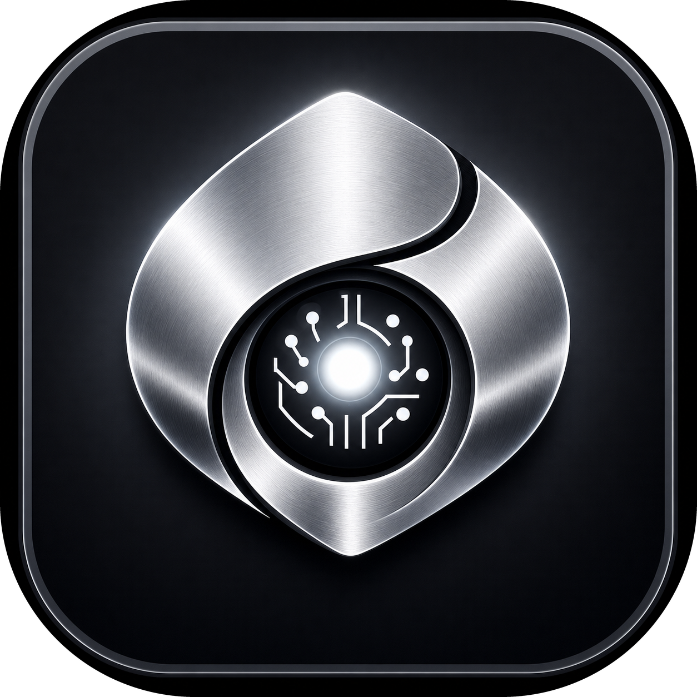
</p>

<p align="center">
  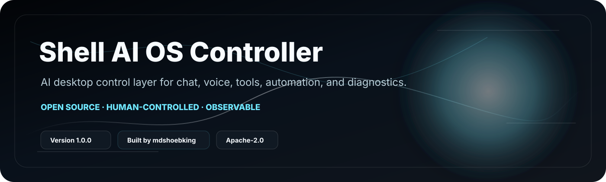
</p>

<h1 align="center">Shell AI OS Controller</h1>

<p align="center">
  A local-first AI desktop control layer for chat, voice, tools, automation, and runtime diagnostics.
</p>

<p align="center">
  <a href="LICENSE"></a>
  
  
  
  
</p>

<p align="center">
  <strong>Version:</strong> 1.0.0 ·
  <strong>Creator:</strong> mdshoebking ·
  <strong>License:</strong> Apache-2.0 ·
  <strong>Primary OS:</strong> Windows 10/11
</p>

<p align="center">
  <a href="videos/shell-current-ui-landscape-demo.mp4">
    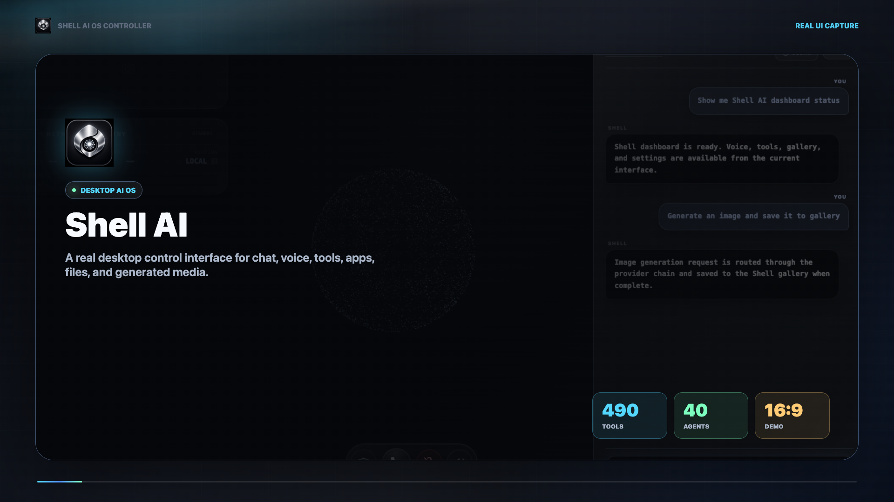
  </a>
</p>

<p align="center">
  <strong><a href="videos/shell-current-ui-landscape-demo.mp4">Watch the current 16:9 Shell Web UI demo</a></strong>
  ·
  <a href="screenshots/current/dashboard.png">Actual current UI screenshots</a>
</p>

---

## What Shell Is

Shell AI OS Controller is a Python desktop assistant and automation platform
that connects a React/Vite/WebGL interface embedded in PyQt WebEngine with AI
providers, voice, local tools, desktop automation, Telegram, email, browser
control, memory, RAG, telemetry, and structured runtime diagnostics.

The current repo also includes **ShellAI Core**, a safe opt-in AI OS controller
backend with a CLI, model router, SQLite memory, reusable skills, tool
registry, policy/audit layer, trace monitor, optimizer suggestions, manual
cron jobs, and a minimal daemon queue. The desktop app keeps the classic
backend by default and can route through ShellAI Core with
`SHELLAI_BACKEND_MODE=shellai_core`.

It is not an operating system replacement, not a custom AGI model, and not a
self-aware system. It is a practical AI-native desktop control layer designed
to make local workflows easier to run, observe, and improve.

## Product Positioning

Shell is positioned as an **AI-native desktop control layer**: part AI
assistant, part automation platform, part local workflow console.

It is built for users who want an AI workspace that can explain readiness,
route tools safely, recover from missing dependencies, and keep the human user
in control.

## Why It Exists

Most AI assistants stop at chat. Shell is built around the idea that an
assistant should also understand tools, runtime state, settings, voice,
desktop actions, and recovery paths.

The goal is simple:

- Fast conversation.
- Real tool execution.
- Clear errors.
- Safe automation.
- Beginner-friendly install.
- Open-source growth.

## Product Experience

Shell is designed around visible confidence:

- A first-launch welcome tour explains chat, voice, tools, and help.
- Health checks show what is ready, missing, or Windows-only.
- Text chat stays text-first unless the user explicitly asks to hear audio.
- Risky automation remains gated by safety settings.
- Release packages exclude secrets, venvs, logs, generated builds, and cloned
  third-party repos.

## Feature Highlights

| Area | What Shell Provides |
| --- | --- |
| Chat | Text chat with streaming-style UI, tool routing, and grounded responses |
| Voice | Gemini voice path plus local TTS fallback and low-latency voice UI |
| Voice Pipeline | Optional wake-word, Silero VAD, and local sherpa-onnx STT fallback with safe button-mode fallback |
| Tools | 460+ catalogued Python tools behind a guarded execution gateway |
| Desktop | App/window control, screenshots, clipboard, keyboard/mouse automation |
| Windows Control | Optional pywinauto UI Automation driver with PyAutoGUI/pywin32 fallback |
| Browser | Browser automation wrappers with safety gates and dry-run support |
| Telegram | Remote-control bot with Settings > API Keys controls for token, allowlist, status, start/stop, and test send |
| Email | SMTP sending with clear Gmail app-password diagnostics |
| Media | Image generation, QR tools, PDF tools, YouTube summaries, OCR hooks |
| Runtime | Health checks, readiness states, logs, production release gates |
| Telemetry | PyQtGraph-backed live CPU/RAM/GPU/network charts with legacy QPainter rollback |
| Installer | One-click Windows bootstrap plus macOS/Linux launch helpers |
| ShellAI Core | `python -m shellai` CLI, agent loop, model routing, memory, skills, tools, monitor, cron, daemon |
| AI OS Fabric | Coordinator/Shell/Safety/Memory/UI/Optimizer agents wired in-process behind stable APIs |
| Memory v2 | Optional local SQLite memory with tags, importance scoring, time decay, redaction, recall audit, and legacy JSON migration |
| Project RAG v2 | Optional incremental codebase index with `.gitignore`-style scanning, BM25/TF-IDF fallback, semantic embeddings, and coding context queries |
| Secure Sandbox | Optional per-run coding workspace with timeout enforcement, secret-scrubbed environment, audit log, rollback cleanup, and network import guard |
| Workflow Checkpoints | Optional agent workflow persistence with last-action tracking, SQLite/JSON storage, resume loading, and auditable rollback checkpoints |
| Safety | SAFE/ASK/BLOCK shell policy, dry-run behavior, audit logs, blocked destructive commands |
| Web UI | React/Vite/WebGL Shell Neural OS renderer embedded in PyQt WebEngine with emerald glass panels, live transcript/chart rail, central particle orb, settings, gallery, tools, and telemetry cards |
| Shell Neural Features | Streaming voice state, permanent core memory, deep focus sessions, remote access records, project folder scanning, coding context packs, and background process inspection |

## Current Repo Status

Latest verified state for this repository:

- `main` is synced to GitHub and the latest CI/Security runs are green.
- GitHub Actions test matrix passes on Python 3.10, 3.11, 3.12, and 3.13.
- Local CI-style regression passes: `538 passed`.
- Release integrity, public package checks, secret pattern guard, dependency audit, and CodeQL pass.
- Real Web UI probes cover Dashboard chart/chat, transcript memory, Settings scroll/API keys, Telegram panel, Gallery render/save, Control Center execution, fake camera/screen streams, animations, and voice button paths.
- Tool/agent probes scan 468 catalog entries with 0 probe errors, and 37/37 agents pass readiness/execution smoke checks.

Details:

- [Current repository status](docs/CURRENT_REPO_STATUS.md)
- [Current system E2E audit](docs/CURRENT_SYSTEM_E2E_AUDIT.md)
- [Media kit](docs/MEDIA_KIT.md)

## Shell Neural UI

Shell's primary desktop interface now uses a React/Vite renderer embedded in
PyQt WebEngine. The renderer lives in `shell_web_ui/` and keeps Shell's Python
backend, tool gateway, voice pipeline, memory, RAG, and safety model behind a
QWebChannel bridge. The older PyQt interface is preserved for rollback in
`shell_ui/`. Local migration backups such as `shell_ui_LEGACY/` are ignored and
should not be committed.

The web renderer is the default path:

```bash
.codex_ui_venv/bin/python launch.py
```

Rollback to the previous PyQt UI:

```bash
SHELL_LEGACY_UI=1 .codex_ui_venv/bin/python launch.py
```

For renderer development:

```bash
cd shell_web_ui
npm install
npm run dev
SHELL_WEB_UI_URL=http://127.0.0.1:5173 ../.codex_ui_venv/bin/python ../launch.py
```

For packaged/local launch without the dev server, build once:

```bash
cd shell_web_ui
npm run build
```

The JavaScript bridge exposes `window.shellAPI.startVoice()`,
`window.shellAPI.stopVoice()`, `window.shellAPI.executeCommand(cmd)`,
`window.shellAPI.getSystemMetrics()`, and `window.shellAPI.searchMemory(query)`.
The renderer also polyfills the original Electron IPC calls so imported visual
components can call Shell's Python backend without changing their UI timing,
animation, or layout code.

Current Web UI notes:

- The Dashboard transcript and chart composer are both text-capable. Typed
  messages stay text-only; voice output is only triggered by voice-source
  replies or the explicit speaker control.
- Settings keeps its tab strip visible while General/API/Security content
  scrolls inside the panel.
- Settings > API Keys includes Telegram Remote Control setup: BotFather token,
  allowed chat IDs, PC-control gate, terminal gate, bot status, start/stop, and
  test-message send.
- Camera and screen share use browser/WebEngine media APIs, with an explicit
  source selector and `STOP CAPTURE` control.
- The checked-in real WebEngine probe is `tools/real_web_ui_cdp_probe.mjs`; it
  exercises main tabs plus nested controls such as Settings scroll, Telegram
  status, Control Center tool execution, Phone error handling, Notes save,
  chart command routing, transcript text, fake camera/screen streams, and voice
  start/stop buttons.

The feature modules are documented in
[`docs/SHELL_NEURAL_INTEGRATION_REPORT.md`](docs/SHELL_NEURAL_INTEGRATION_REPORT.md), and
latency notes are tracked in
[`docs/SHELL_PERFORMANCE_BENCHMARK.md`](docs/SHELL_PERFORMANCE_BENCHMARK.md).

### Performance Flags

- `SHELL_PYQTGRAPH_ENABLED=1` (default) uses PyQtGraph for live telemetry
  charts. Set `SHELL_PYQTGRAPH_ENABLED=0` to roll back to the preserved legacy
  QPainter chart implementation.
- `SHELL_WAKE_WORD_ENABLED=0` (default) keeps hands-free wake detection off
  until explicitly tested. Enable with `SHELL_WAKE_WORD_ENABLED=1` and provide a
  custom "Hey Shell" openWakeWord model via `SHELL_WAKE_WORD_MODEL_PATHS`.
- `SHELL_VAD_ENABLED=0` (default) keeps the current timing endpointing path.
  Enable with `SHELL_VAD_ENABLED=1` to use Silero streaming VAD; if loading
  fails, Shell falls back to the existing timing logic.
- Wake-word sensitivity can be tuned in Settings under Voice & Speech, or with
  `SHELL_WAKE_WORD_SENSITIVITY` / `SHELL_WAKE_WORD_THRESHOLD`.
- `SHELL_PYWINAUTO_ENABLED=0` (default) keeps legacy Windows automation active.
  Set `SHELL_PYWINAUTO_ENABLED=1` on Windows to prefer pywinauto's UI Automation
  backend for app launch, focus, close, resize, minimize, maximize, and window
  listing. PyAutoGUI/pywin32 remain fallback paths.
- `SHELL_MEMORY_V2_ENABLED=0` (default) keeps the legacy JSON memory tools as
  the primary path. Set `SHELL_MEMORY_V2_ENABLED=1` to route memory tools to
  the local SQLite Memory v2 store. Optional `SHELL_MEMORY_V2_PATH` selects the
  database path, and `SHELL_MEMORY_V2_DECAY_DAYS` tunes time-decay half-life.
  Public APIs are `save_memory()`, `recall_memory()`, and `forget_memory()` in
  `shell_memory_v2.py`; `memory_v2_migrate_legacy_tool` imports
  `~/.shell_smart_memory.json`.
- `SHELL_LOCAL_STT_ENABLED=0` (default) keeps Google/SpeechRecognition as the
  active STT path. Set `SHELL_LOCAL_STT_ENABLED=1` plus
  `SHELL_LOCAL_STT_MODEL_DIR=/path/to/sherpa-model` to enable offline
  sherpa-onnx fallback when the speech API is unavailable. Optional
  `SHELL_LOCAL_STT_PRIMARY=1` tries local STT first and falls back to the
  current API path if local model loading fails.
- `SHELL_PROJECT_RAG_ENABLED=0` (default) keeps project indexing off. Set
  `SHELL_PROJECT_RAG_ENABLED=1` to enable incremental local codebase indexing
  and `project_rag_query_tool` / `project_rag_index_tool`. Optional
  `SHELL_PROJECT_RAG_EMBEDDINGS_ENABLED=1` enables sentence-transformers
  embeddings when a local/available model is configured; lexical BM25/TF-IDF
  fallback remains available without embeddings.
- `SHELL_SECURE_SANDBOX_ENABLED=0` (default) keeps existing direct code
  execution behavior. Set `SHELL_SECURE_SANDBOX_ENABLED=1` to route Python code
  execution through an isolated temporary workspace with secret-scrubbed
  environment variables, timeout enforcement, rollback cleanup, and JSONL audit
  records. Optional settings include `SHELL_SECURE_SANDBOX_TIMEOUT_S`,
  `SHELL_SECURE_SANDBOX_NETWORK`, `SHELL_SECURE_SANDBOX_AUDIT`,
  `SHELL_SECURE_SANDBOX_ROOT`, and `SHELL_SECURE_SANDBOX_KEEP_SUCCESS`.
  Network blocking currently uses a Python import guard by default; future
  Docker/bubblewrap isolation can be added behind the same flag.
- `SHELL_WORKFLOW_CHECKPOINTS_ENABLED=0` (default) keeps agent workflow state
  persistence off. Set `SHELL_WORKFLOW_CHECKPOINTS_ENABLED=1` to enable
  `save_checkpoint()`, `load_checkpoint()`, and `rollback()` in
  `shell_workflow_checkpoints.py`, plus checkpoint tools for multi-step agents.
  Optional settings include `SHELL_WORKFLOW_CHECKPOINTS_BACKEND=sqlite|json`,
  `SHELL_WORKFLOW_CHECKPOINTS_PATH`, and
  `SHELL_WORKFLOW_CHECKPOINTS_MAX_PER_WORKFLOW`.
- `SHELL_LEGACY_UI=0` (default) launches the new Shell Web UI through
  PyQt WebEngine. Set `SHELL_LEGACY_UI=1` for rollback to the previous PyQt
  interface.
- `SHELL_WEB_UI_URL` points the PyQt host at a running Vite dev server instead
  of `shell_web_ui/dist/index.html`.
- `VITE_SHELL_WEB_USE_GEMINI=1` re-enables the renderer's direct Gemini live
  voice path during web UI development. By default, the power/mic controls call
  Shell's Python bridge.

## Screenshots

Current public screenshots are stored in `screenshots/current/`. They are real
1440x900 PNG captures from the running Shell Web UI through PyQt WebEngine, not
handmade mockups. These screenshots are the primary visuals for README, docs,
and the landscape Remotion demo.

| Dashboard | Control Center |
| --- | --- |
| 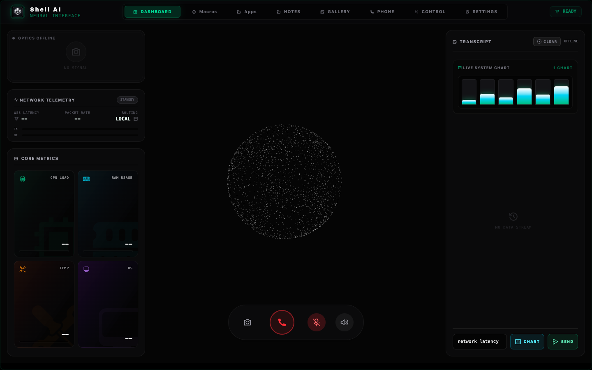 | 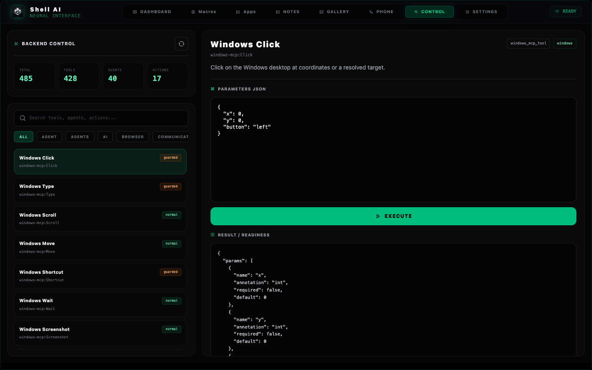 |

| Gallery | Settings |
| --- | --- |
| 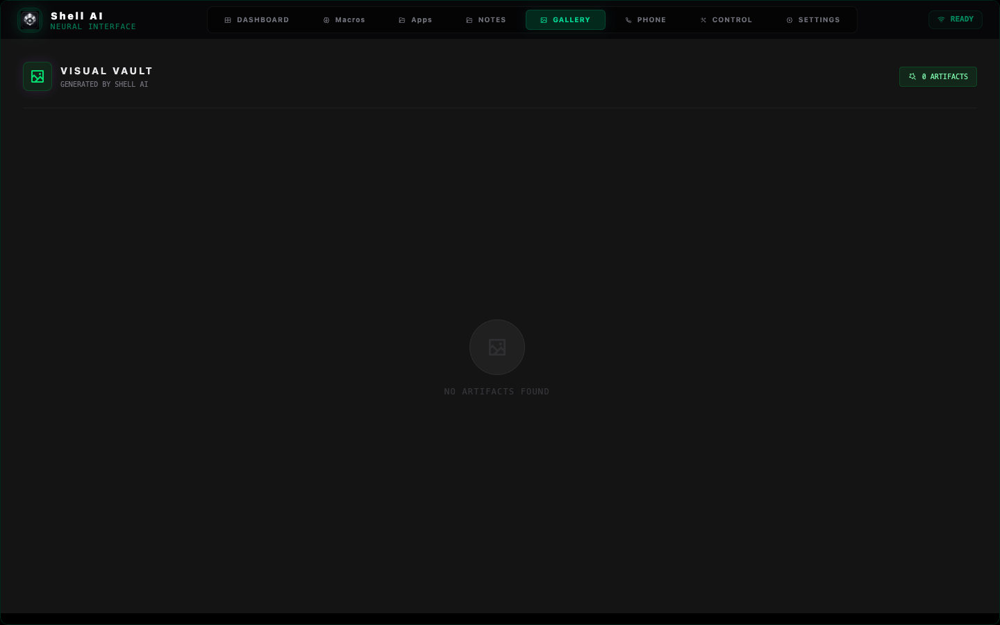 | 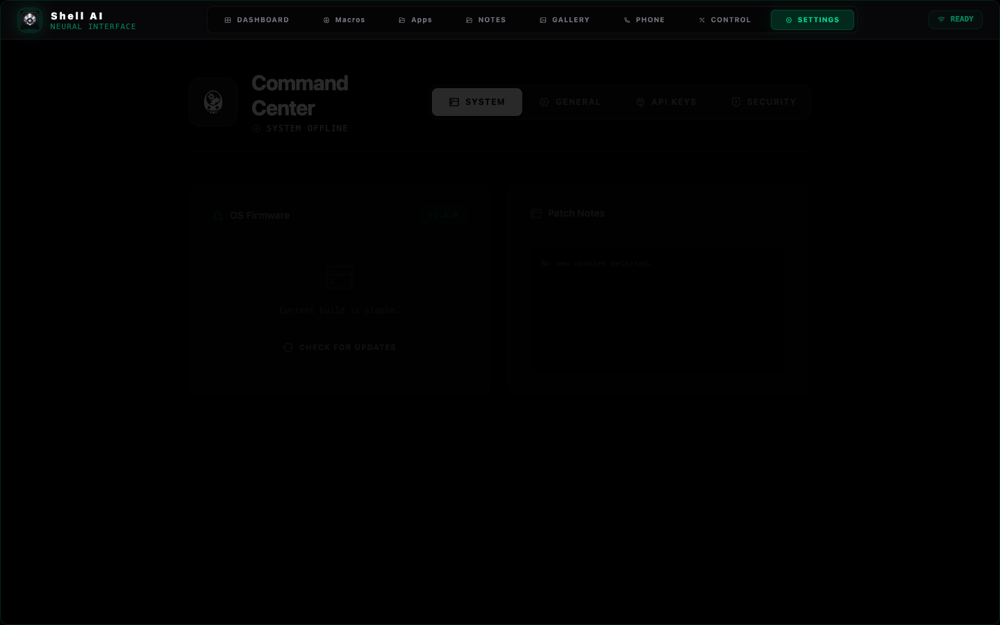 |

| Apps | Notes |
| --- | --- |
| 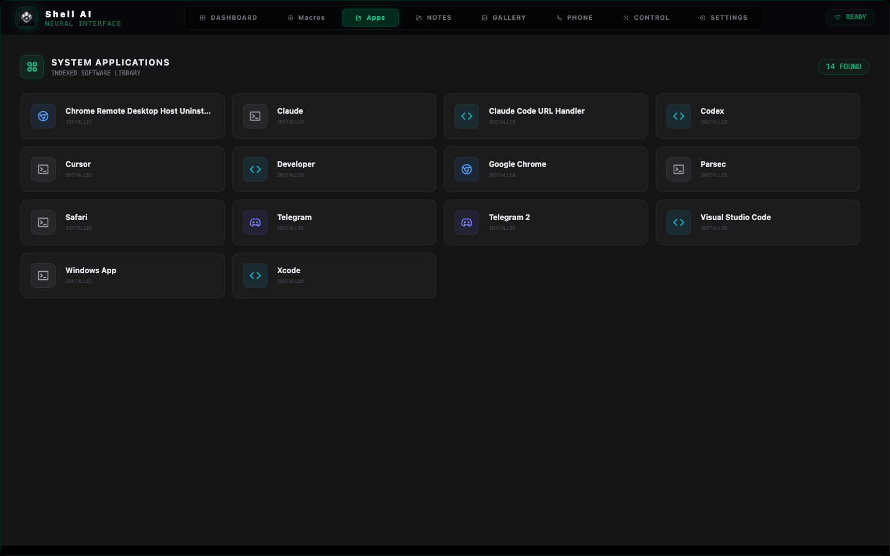 | 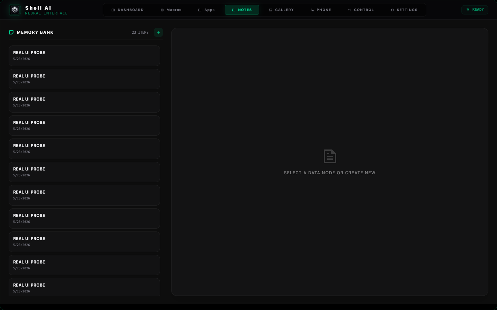 |

| Phone | Macros |
| --- | --- |
| 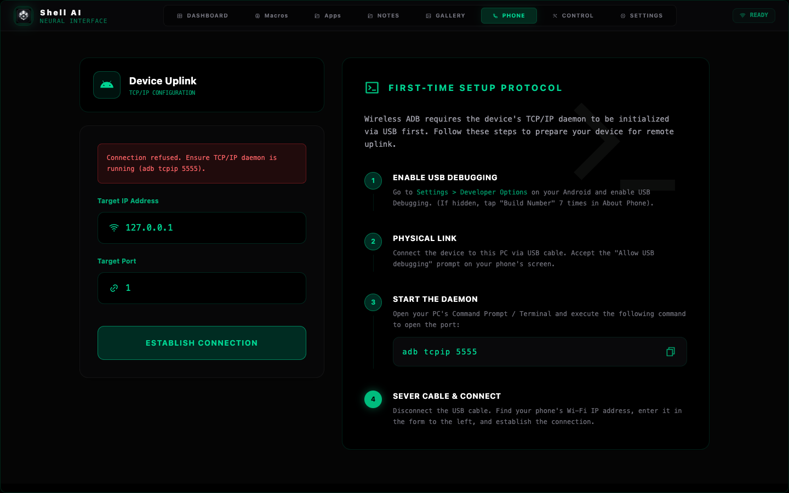 | 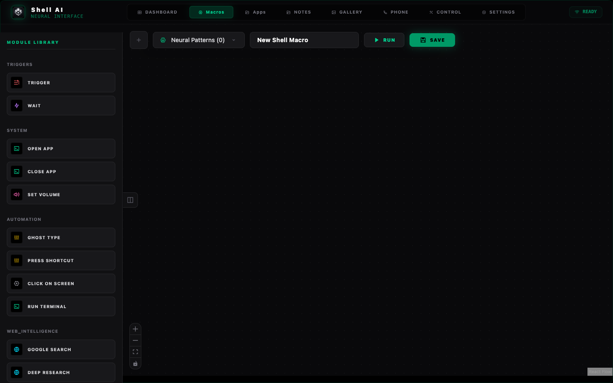 |

## Demo Media

### Current 16:9 Landscape Demo

<p align="center">
  <a href="videos/shell-current-ui-landscape-demo.mp4">
    
  </a>
</p>

<p align="center">
  <strong><a href="videos/shell-current-ui-landscape-demo.mp4">Watch the current 16:9 Shell Web UI demo</a></strong>
</p>

| Media | Preview |
| --- | --- |
| Current 16:9 Web UI Demo | <a href="videos/shell-current-ui-landscape-demo.mp4"></a> |
| Actual Current Dashboard | <a href="screenshots/current/dashboard.png"></a> |

Recommended launch media:

- 36-second current 16:9 English Web UI demo.
- 90-second real voice demo after Gemini/remote audio setup.
- 2-minute "chat opens apps and runs tools" demo.
- 5-minute technical architecture walkthrough.

Current media files:

- [Current 16:9 Web UI demo MP4](videos/shell-current-ui-landscape-demo.mp4)
- [Current 16:9 Web UI demo poster](videos/shell-current-ui-landscape-poster.png)
- [Actual current UI screenshots](screenshots/current/README.md)

## Architecture

<p align="center">
  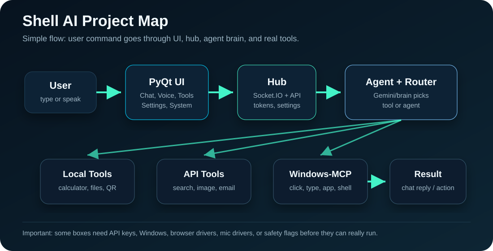
</p>

High-level flow:

```text
User
  -> React Web UI in PyQt WebEngine / Voice / Telegram
  -> QWebChannel + Shell Hub + Runtime State
  -> NL Router + Tool Gateway + Agent Orchestrator
  -> Local Tools / APIs / Desktop Automation / Browser Automation
  -> Structured Result + Logs + UI Event Stream

Optional ShellAI Core path:

User / CLI / Desktop feature flag
  -> ShellAI API
  -> AgentRuntime + CoordinatorAgent
  -> MemoryAgent + ModelRouter + SafetyAgent
  -> ToolRegistry / ShellTool / FileTool / OSTool
  -> Trace + SQLite memory + UI summary
```

## Folder Structure

```text
.
├── agent.py                         # Main AI agent runtime
├── shellai/                         # ShellAI Core CLI, agent loop, fabric, memory, skills, tools
├── shell_web_ui/                    # React/Vite/WebGL renderer embedded by PyQt WebEngine
├── shell_ui/                        # Legacy PyQt desktop interface and shared boot assets
├── core/shellai_bridge.py           # Feature-flagged desktop bridge to ShellAI Core
├── shell_tool_gateway.py            # Tool execution gateway
├── shell_telegram.py                # Telegram bot integration
├── shell_windows_mcp.py             # CursorTouch Windows-MCP bridge
├── core/                            # Modular runtime, health, memory, orchestration
├── installer/                       # Bootstrap, health, and repair logic
├── tools/                           # Release, probes, diagnostics, packaging
├── docs/                            # Architecture and rollout documents
├── assets/brand/                    # Official Shell logo and brand rules
├── screenshots/                     # Current public UI captures
├── gifs/                            # Reserved for future current UI GIFs
├── videos/                          # Current 16:9 demo and Remotion source
├── banners/                         # Public banner and social assets
├── .github/                         # Issue and pull request templates
├── LICENSE                          # Apache-2.0 license
├── NOTICE                           # Attribution notice
├── LEGAL.md                         # Beginner-friendly legal report
├── SECURITY.md                      # Security policy
└── THIRD_PARTY_NOTICES.md           # Dependency/license audit notes
```

## Beginner Install

### Windows

For normal users:

```text
1. Download Shell AI Windows setup EXE from the latest release.
2. Double-click shell-ai-os-controller-setup-[version].exe.
3. Keep "Install or repair Shell AI dependencies now" selected on first install.
4. Launch Shell AI from the Start Menu or desktop shortcut.
```

The setup EXE installs Shell into your user profile, creates Start Menu
shortcuts, can optionally add a desktop shortcut, and can optionally start
Shell when Windows starts. During first install it runs the same safe bootstrap
as `ONE_CLICK_INSTALL.bat`.

Source zip fallback:

```text
1. Download the release zip.
2. Extract it.
3. Double-click ONE_CLICK_INSTALL.bat.
4. Double-click Start_ShellAI.bat.
```

What the bootstrap does:

- Detects Python.
- Creates a virtual environment.
- Installs Python dependencies.
- Installs and builds the React Shell Web UI in `shell_web_ui/`.
- Runs health checks.
- Prepares runtime folders.
- Starts Shell through the production launcher.

If something breaks:

```text
Double-click Repair_ShellAI.bat
```

Build the Windows setup EXE on a Windows build machine:

```text
Double-click Build_Windows_EXE.bat
```

The generated installer is written to `dist\shell-ai-os-controller-setup-[version].exe`.
The Settings > System tab can check the release feed and show `UPDATE NOW`
when a newer setup EXE is attached to the latest GitHub release.

The React Shell Web UI build requires Node.js/npm 20.19+ or 22.12+. On Windows,
the installer and repair flow refresh PATH after winget, resolve `npm.cmd`
directly, upgrade old Node LTS installs, and only then run the Web UI
install/build steps.

### macOS

```bash
chmod +x ONE_CLICK_INSTALL.command start_shellai.command repair_shellai.command
./ONE_CLICK_INSTALL.command
./start_shellai.command
```

### Linux

```bash
chmod +x start_shellai.sh repair_shellai.sh
./start_shellai.sh
```

For a detailed beginner guide, see [docs/INSTALL_BEGINNER.md](docs/INSTALL_BEGINNER.md).

## Documentation

- [Documentation index](docs/README.md)
- [Product experience](docs/PRODUCT_EXPERIENCE.md)
- [Design system](DESIGN.md)
- [Phase 6 UI/UX audit](docs/UI_UX_PHASE6_REPORT.md)
- [Product experience design](docs/PRODUCT_EXPERIENCE_DESIGN.md)
- [Screenshot and demo strategy](docs/SCREENSHOT_DEMO_STRATEGY.md)
- [Trust and credibility](docs/TRUST_AND_CREDIBILITY.md)
- [Beginner install guide](docs/INSTALL_BEGINNER.md)
- [Developer guide](docs/DEVELOPER_GUIDE.md)
- [Architecture guide](docs/ARCHITECTURE_GUIDE.md)
- [ShellAI Core and AI OS Fabric](docs/SHELLAI_FABRIC.md)
- [API and tool guide](docs/API_GUIDE.md)
- [Troubleshooting](docs/TROUBLESHOOTING.md)
- [FAQ](docs/FAQ.md)
- [Advanced usage](docs/ADVANCED_USAGE.md)
- [Roadmap](docs/ROADMAP.md)
- [AI ecosystem roadmap](docs/ECOSYSTEM_ROADMAP.md)
- [Website plan](docs/WEBSITE_PLAN.md)
- [Public launch plan](docs/PUBLIC_LAUNCH_PLAN.md)
- [Community guide](docs/COMMUNITY.md)
- [Release process](docs/RELEASE_PROCESS.md)
- [Enterprise architecture review](docs/ENTERPRISE_ARCHITECTURE_REVIEW.md)
- [AI infrastructure plan](docs/AI_INFRASTRUCTURE_PLAN.md)
- [Configuration system](docs/CONFIGURATION_SYSTEM.md)
- [Observability and debugging](docs/OBSERVABILITY_AND_DEBUGGING.md)
- [Enterprise security preparation](docs/ENTERPRISE_SECURITY_PREP.md)
- [Cloud infrastructure readiness](docs/CLOUD_INFRASTRUCTURE_PHASE7.md)
- [API ecosystem](docs/API_ECOSYSTEM_PHASE7.md)
- [Advanced AI orchestration](docs/AI_ORCHESTRATION_PHASE7.md)
- [Sync and storage strategy](docs/SYNC_STORAGE_STRATEGY_PHASE7.md)
- [Phase 7 security infrastructure](docs/SECURITY_INFRASTRUCTURE_PHASE7.md)
- [Plugin and automation ecosystem](docs/PLUGIN_AUTOMATION_ECOSYSTEM_PHASE7.md)
- [DevOps and cloud deployment](docs/DEVOPS_CLOUD_DEPLOYMENT_PHASE7.md)
- [Enterprise and product strategy](docs/ENTERPRISE_TEAM_PRODUCT_STRATEGY_PHASE7.md)
- [AI agent ecosystem](docs/AI_AGENT_ECOSYSTEM_PHASE8.md)
- [Multi-agent orchestration](docs/MULTI_AGENT_ORCHESTRATION_PHASE8.md)
- [AI memory system](docs/AI_MEMORY_SYSTEM_PHASE8.md)
- [Tool execution and automation](docs/TOOL_EXECUTION_AUTOMATION_PHASE8.md)
- [Automation marketplace](docs/AUTOMATION_MARKETPLACE_PHASE8.md)
- [Agent safety and governance](docs/AGENT_SAFETY_GOVERNANCE_PHASE8.md)
- [Voice and multimodal future](docs/VOICE_MULTIMODAL_FUTURE_PHASE8.md)
- [Developer SDK ecosystem](docs/DEVELOPER_SDK_ECOSYSTEM_PHASE8.md)
- [Global launch strategy](docs/GLOBAL_LAUNCH_PHASE9.md)
- [Enterprise distribution](docs/ENTERPRISE_DISTRIBUTION_PHASE9.md)
- [Brand authority and trust](docs/BRAND_AUTHORITY_TRUST_PHASE9.md)
- [Community growth](docs/COMMUNITY_GROWTH_PHASE9.md)
- [Content and education](docs/CONTENT_EDUCATION_PHASE9.md)
- [Website and public presence](docs/WEBSITE_PUBLIC_PRESENCE_PHASE9.md)
- [Enterprise adoption](docs/ENTERPRISE_ADOPTION_PHASE9.md)
- [Analytics and product insight](docs/ANALYTICS_PRODUCT_INSIGHT_PHASE9.md)
- [Sustainability strategy](docs/SUSTAINABILITY_PHASE9.md)
- [Competitive positioning](docs/COMPETITIVE_POSITIONING_PHASE9.md)
- [Long-term governance](docs/LONG_TERM_GOVERNANCE_PHASE9.md)
- [Final master ecosystem report](docs/FINAL_MASTER_ECOSYSTEM_REPORT.md)
- [Public GitHub release playbook](docs/PUBLIC_GITHUB_RELEASE_PLAYBOOK.md)

## Developer Setup

```bash
git clone <your-fork-url> shell-ai-os-controller
cd shell-ai-os-controller

python -m venv venv
source venv/bin/activate      # macOS/Linux
# venv\Scripts\activate       # Windows

pip install -r requirements.txt
cp .env.example .env
python agent.py console
```

Required for full voice mode:

- `GOOGLE_API_KEY`
- `LIVEKIT_API_KEY`
- `LIVEKIT_API_SECRET`
- `LIVEKIT_URL`

Optional features need their own API keys or dependencies. Missing optional
providers should produce clear readiness messages instead of crashing the app.

ShellAI Core CLI:

```bash
python -m shellai doctor
python -m shellai run "!pwd" --json
python -m shellai skills list
python -m shellai monitor
python -m shellai optimize
python -m shellai cron list
python -m shellai daemon status
```

Desktop ShellAI Core bridge is opt-in:

```bash
SHELLAI_BACKEND_MODE=shellai_core python launch.py
```

Keep `SHELLAI_BACKEND_MODE=classic` or unset for the existing desktop behavior.

## Common Commands

```bash
python3 -m shellai doctor
python3 -m shellai run "!pwd" --json
python3 -m shellai monitor --limit 10
python3 -m shellai optimize
python3 -m shellai cron run skill_usage_report --dry-run
python3 tools/production_release_check.py --strict
python3 tools/package_public_release.py
python3 tools/production_readiness.py --run-tests
python3 tools/cloud_readiness_audit.py --fail-on-high
python3 tools/agent_ecosystem_audit.py --fail-on-high
python3 tools/launch_readiness_audit.py --fail-on-high
python3 tools/public_github_launch_audit.py --fail-on-high
python3 tools/ecosystem_master_audit.py --fail-on-high
python3 -m pytest -q
```

## Troubleshooting

| Problem | Fix |
| --- | --- |
| Voice is silent | Check output device, Windows volume, `DISABLE_TTS`, and provider/API status |
| Gemini says API key invalid | Replace `GOOGLE_API_KEY` with a valid key from Google AI Studio |
| Email login rejected | Use a Gmail App Password, not the normal Gmail password |
| Windows-MCP unavailable | Use Windows with Python 3.13+ and `uv/uvx`; macOS/Linux show a safe unsupported message |
| `ModuleNotFoundError` | Run the one-click installer or repair script |
| Telegram bot does not respond | Add token, enable bot, confirm allowed chat IDs and remote-control settings |

More detail: [docs/INSTALL_BEGINNER.md](docs/INSTALL_BEGINNER.md).

## FAQ

**Is Shell an operating system?**

No. It is a desktop AI control layer that runs on top of your OS.

**Can I use it commercially?**

Yes. The project is Apache-2.0 licensed. Third-party APIs and services still
have their own terms.

**Can it control my PC from Telegram?**

Yes, but only after you configure the Telegram token and enable the relevant
remote-control permissions.

**Does it run on macOS/Linux?**

Partially. The primary target is Windows. Cross-platform UI and many tools work,
but Windows-MCP is Windows-only.

**Does it include API keys?**

No. Users must provide their own keys in `.env`. Never commit `.env`.

## Web UI QA Notes

- Dashboard transcript now has a small `CLEAR` button that clears persisted web UI history.
- The Dashboard `CHART` button supports both telemetry prompts and normal text prompts:
  - `show CPU chart` updates the chart and writes a short chart reply.
  - `what is memory in Python?` and `explain network protocols` route to text chat, not telemetry.
  - `calculate 2+2` routes through the Shell backend command/tool path and stays text-only.
- Text-originated chart/transcript messages do not trigger voice output.
- Settings `GENERAL` and `API KEYS` panels are scrollable where needed, and Telegram Remote Control lives inside `Settings > API Keys`.
- Real UI probes are available:
  - `node tools/real_web_ui_cdp_probe.mjs 9235 .shell_runtime/real_web_ui_cdp_probe_loop5_final`
  - `node tools/chart_transcript_ui_probe.mjs 9235 .shell_runtime/chart_transcript_ui_probe_loop4_clean_pass`

## Roadmap

- [ ] Add interactive approvals UI for ShellAI Core ASK-level commands.
- [ ] Add reusable checked-in visible UI probe for the ShellAI Core bridge.
- [ ] Add richer ADB, VS Code, git, and browser tool adapters to ShellAI Core.
- [ ] Add OpenSSL-backed Python runtime guidance to remove local LibreSSL urllib3 warnings.
- [ ] Improve first-run setup wizard and diagnostics UX.
- [ ] Add signed installers and macOS notarization.
- [ ] Add official documentation website.
- [ ] Add more reproducible UI screenshot and demo GIF generation.
- [ ] Harden plugin marketplace and external skill audit flow.
- [ ] Add CI release automation after Windows acceptance testing is stable.
- [ ] Add encrypted local database and sync envelope implementation.
- [ ] Publish generated OpenAPI docs after external auth is ready.
- [ ] Add durable background agent queue with supervisor watchdogs.
- [ ] Add signed automation template import/export before public marketplace.
- [ ] Complete fresh Windows acceptance test before public GA.
- [ ] Add signed Windows installer and macOS notarized app before enterprise distribution.
- [ ] Publish product website and social preview assets.
- [ ] Prepare first community-friendly good-first-issue set.

## Contributing

Contributions are welcome after the public repository is opened.

Start here:

- [CONTRIBUTING.md](CONTRIBUTING.md)
- [.github/PULL_REQUEST_TEMPLATE.md](.github/PULL_REQUEST_TEMPLATE.md)
- [.github/ISSUE_TEMPLATE](.github/ISSUE_TEMPLATE)
- [SECURITY.md](SECURITY.md)

Before opening a pull request:

```bash
python3 -m pytest -q
python3 tools/production_release_check.py --strict
```

## Security

Do not commit secrets, tokens, `.env`, runtime logs, local chat history, or
private screenshots. See [SECURITY.md](SECURITY.md).

## License

Shell AI OS Controller is released under the **Apache License 2.0**
(`Apache-2.0`).

Copyright 2026 **mdshoebking**.

See:

- [LICENSE](LICENSE)
- [NOTICE](NOTICE)
- [LEGAL.md](LEGAL.md)
- [THIRD_PARTY_NOTICES.md](THIRD_PARTY_NOTICES.md)

## Credits

Built by **mdshoebking**.

This project is being prepared as an open-source AI desktop automation platform
with a focus on safety, clarity, and beginner-friendly setup.
